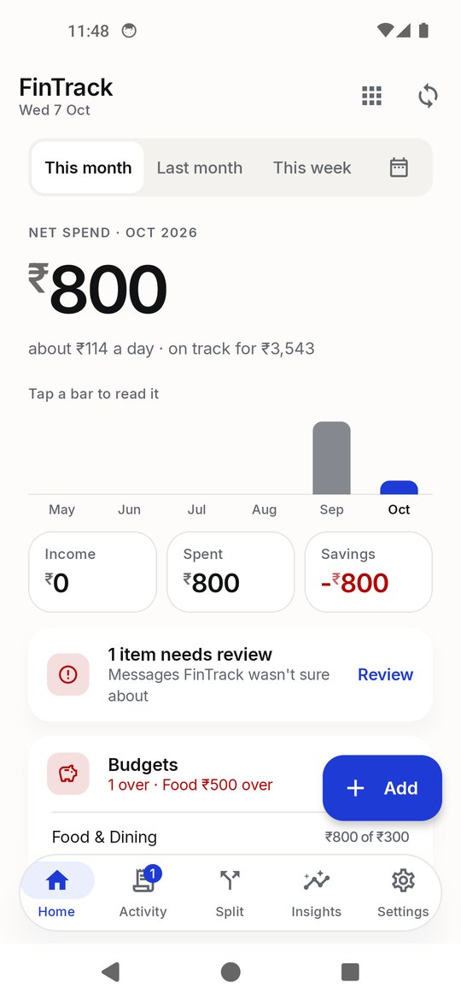
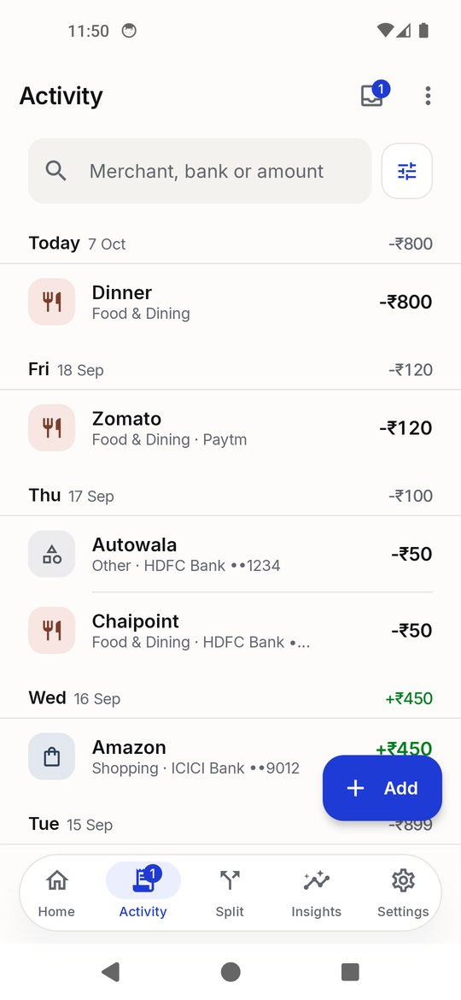
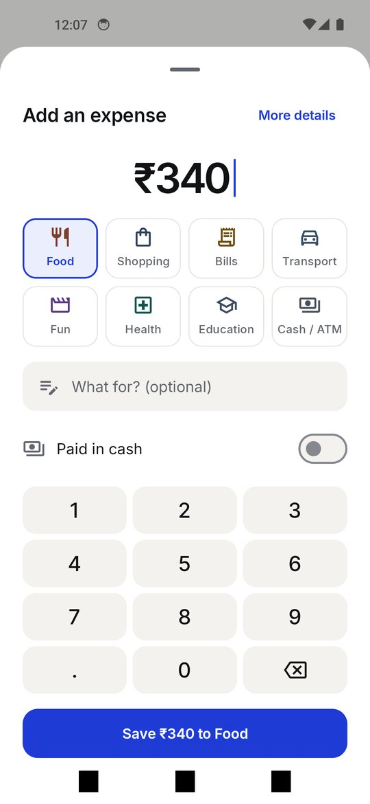

# FinTrack: private, on-device personal finance tracker for Android

FinTrack reads bank, UPI and credit-card alert SMS, turns them into transactions, and shows where your money goes.
Everything is stored in an encrypted database on your phone. There is no cloud sync, no account, no analytics and
no tracking SDK. It is a personal project, not a production app: it works well for its author, and its limits are
written down below.

- Kotlin, Jetpack Compose, Material 3
- Room on SQLCipher (AES-256) for storage
- Android 12+ (minSdk 31, targetSdk 35)

<p>



</p>

## Download

Get the latest APK from the [Releases page](https://github.com/Lukey-7/Personal_Finance_app/releases/latest). Each
release attaches **one file, the arm64-v8a APK** (any phone from the last several years), with its SHA-256 in the
notes. It is the author's **personal build with an OpenAI key built in** (the name ends in `-personal`), so don't
pass it around; build your own (below) for a copy with no key.

## Features

**Core**

- **Reads your bank SMS.** A layered, bank-agnostic parser books debits and credits from most Indian banks, UPI apps
  and card networks, with no per-bank templates. Unsure messages go to a **review queue** instead of being guessed,
  and confirming one teaches the parser that sender's wording.
- **A dashboard you can audit.** Net spend = gross spend - refunds; savings = income - net spend. Transfers,
  card-bill payments and investments are kept apart and never counted as spend. Every figure opens the
  transactions behind it.
- **Activity and transaction detail.** Every payment by day with search and filters; swipe to recategorise or
  delete (with undo); select several to recategorise at once. Each payment opens a read-first page with its SMS,
  links to splits, refunds and bills, and its tax section.
- **Quick add.** A sheet with a number pad and a category grid, also from the widget and the app shortcut.
- **Correct counting.** Amounts are integer paise. One payment reported by two SMS is stored once. Every
  transaction has a *flow* (expense, income, refund, transfer, investment, cash, settlement) that decides how it
  counts. Refunds are paired with their purchase; failed payments that came straight back are hidden.
- **Budgets and insights.** Monthly limits per category; weekly and monthly trends you can read by touch; category
  changes and local "reduce spending" tips.
- **Split bills.** Photograph a bill (read on the phone, English and Hindi) and split it equally, by shares, amounts
  or item; only your share counts as your spend. FinTrack also spots shared payments and friends paying you back.
  See [Splitting a bill](#splitting-a-bill).

**Money tools**

- **Subscriptions** with yearly cost and price-rise flags; **bills and loan EMIs** marked paid when the payment
  arrives; **credit-card cycles** and rewards; **savings goals**; a **tax helper** (80C, 80D, NPS, rent, donations)
  with CSV; **net worth** from SMS balances, a mutual-fund CAS PDF and what you type in.
- **Ask FinTrack:** plain questions ("food last month") answered by rules on the phone, with Gemini Nano on phones
  that have it.
- **Reminders** before bills and renewals, and a **home-screen widget** (two sizes) with amounts hidden by default.

**Power-user**

- **Import statements and screenshots:** PDF (including password-protected and scanned), Excel and CSV from any
  bank, and Google Pay / PhonePe / Paytm / Amazon Pay history screenshots, with the running balance checked and
  every import undoable.
- **SMS log** of every scanned message and what happened to it; **rescan the last 12 months** with the current
  parser without bringing back anything you deleted or overwriting your edits; **duplicate clean-up**.
- **Encrypted backup** to one passphrase-locked file; **CSV export**; **clear everything**.
- **Optional AI summary** with your own OpenAI key, on demand only, showing exactly what is sent.

## Using the app

1. On first launch, three short screens explain what FinTrack reads and what stays private; allow SMS access or
   skip to manual entry. The first scan runs in front of you and lands on Home.
2. New messages are imported automatically while auto-import is on. The **Activity** badge counts messages that
   need review; **Activity › SMS log** shows what was skipped and why.
3. Tap any number on **Home** to see the payments behind it; tap a payment to read it, then **Edit** to fix its
   flow or category.
4. Set monthly limits under **Budgets** (from Home or Insights); the money tools are behind the grid icon on Home.
5. Use **Split** to photograph a bill, check the numbers, add people and save.
6. Optionally add an OpenAI key in **Settings › AI**.

## Security and privacy

| Area | What the app does |
|---|---|
| Database | Encrypted with SQLCipher. A random 256-bit key is created per install and kept in EncryptedSharedPreferences backed by the Android Keystore. `secure_delete` is on, so cleared rows are overwritten. |
| API key | Stored only in EncryptedSharedPreferences using AES-256-GCM with a Keystore master key. Never logged or exported, and never in the source. **The APK attached to GitHub releases is a personal build with the author's own OpenAI key built in** (file names end in `-personal`); anyone holding the file can extract that key. Build your own APK without `FINTRACK_EMBED_KEY` to get one with no key (see `docs/RUNNING.md`). A built-in key can be changed or removed in Settings. |
| SMS | Only messages from alphanumeric sender IDs such as `VM-HDFCBK` are read. Personal messages from phone numbers are skipped. Only parsed fields are stored. Raw text is kept only for messages waiting in the review queue, and is deleted when you resolve them. The SMS log stores sender, time, outcome, reason and amount, never the body. |
| Bill photos | Read on the phone by ML Kit Text Recognition with the **bundled** Latin and Devanagari models (`com.google.mlkit:text-recognition`, `com.google.mlkit:text-recognition-devanagari`): no model download, works in airplane mode. The camera capture goes to a temp file in app-private cache and is deleted after recognition, whether or not it succeeded; gallery images are read through the system Photo Picker without a storage permission. No image is stored or sent. ML Kit's own anonymous usage logging to Google is on; see [What ML Kit sends](#what-ml-kit-sends). |
| Statements and screenshots | Picked through the system file / photo picker (no storage permission), read on the phone and not kept. A PDF password is used in memory to open the file and never stored. Only the parsed fields of each transaction are saved, like SMS. |
| Network | The only network calls in the codebase go to `https://api.openai.com`: when you tap **Generate summary**, and, if you have a key and "Use AI for unclear cases" is on, for split intelligence. Cleartext HTTP is disabled app-wide. Separately, Google ML Kit sends its own anonymous usage logs, and Android AICore downloads the Gemini Nano model on phones that use it ([What ML Kit sends](#what-ml-kit-sends)). |
| Data sent to OpenAI | Summary: category totals, counts, budgets, and this and last month's totals. Settings has a **What is sent?** button that shows the exact payload. Split intelligence: for payments the on-phone rules cannot explain, the amounts, relative days and times, a payment type ("restaurant, food") and "Person A"-style labels for whoever sent money. Never merchant or people's names, SMS or statement text, bank names or account numbers. Answers are cached so the same week is never sent twice. |
| Backups | `allowBackup=false` and data-extraction rules exclude everything from cloud backup and device-to-device transfer. Your own backup (Settings → Backup) is one file sealed with AES-256-GCM under a key derived from your passphrase (PBKDF2-HMAC-SHA256, 600,000 rounds, random salt); FinTrack writes it only where you pick and never uploads it. Without the passphrase it cannot be opened. |
| Reminders and widget | Worked out on the phone by WorkManager twice a day; notifications keep amounts off the lock screen. The widget shows "₹••••" unless you turn on amounts. |
| Release build | R8 minification is on, and all `android.util.Log` calls are stripped. Screenshots and screen recording are allowed (no `FLAG_SECURE`), so the screen is as private as your phone. |
| Third parties | Only AndroidX and Google libraries, plus SQLCipher. No Firebase SDK, analytics, crash reporting or ads. `scripts/audit_apk.py` checks each build: ML Kit's logging classes may not grow, and the only endpoint in FinTrack's own code is `api.openai.com`. |
| CSV export | Written to a location you pick through the system file picker. Cells are escaped against spreadsheet formula injection. |

Two things are outside the app's control. An exported CSV is plain text, so treat it like a bank statement. If you use the AI feature, OpenAI's own data policy applies to the aggregated numbers you send.

## What ML Kit sends

FinTrack uses two Google ML Kit libraries: **text recognition** (bill photos, scanned statements) and, from
v1.3, **GenAI Prompt** (Gemini Nano in Ask, on phones that have it). Both run their models on the phone: no bill
photo, SMS, statement, question or answer is sent anywhere by them or by FinTrack.

They do carry Google's own **usage logging**, and it is left on:

- Both libraries include Google's logging transport (`com.google.android.datatransport`, the "firelog" / CCT
  backend) and ship with `enableFirelog=true` in their logging options. This has been true since v1.1 for text
  recognition; the APK audit shows it in every release.
- Per Google's ML Kit terms, these logs are anonymous metrics about the library itself: which feature ran, how
  long it took, errors, the ML Kit and Android versions and the device model. They are batched and sent later
  by the transport's scheduled job, not at the moment a bill is read, which is why the earlier "a recognition
  sends zero bytes" measurement saw nothing.
- The endpoint is built inside the library, so it does not appear as a plain URL in the APK. The audit therefore
  watches the logging classes themselves (`scripts/audit_apk.py`): their count may not grow without a decision.
- Gemini Nano's model is downloaded and run by Android's AICore system service, not by FinTrack.

Earlier versions of this README said the OCR libraries contained no logging code. That was wrong: the classes
were there in v1.1 and v1.2 too.

## Splitting a bill

**Split › New split › Photo** (camera) or **Gallery**. The bill is read on the phone and fills in the
name, date, total, tax / tip / discount and line items; everything stays editable. Or skip the photo and
type the total. Add people (or quick-add 2–5), choose who paid, and split **Equal**, **Shares**, **Custom
amounts** or **By item** (tag people on each item; tax, service and discount are spread in proportion).
The app checks that items + tax − discount = total, and only your share counts as your spending.

**Engine.** Google ML Kit text recognition with bundled models only, Latin plus Devanagari, both inside the
APK. Both read each photo in parallel; the Devanagari reading is used only when the bill actually contains
Hindi script, so English and Hinglish bills keep the stronger Latin model. The photo is discarded after
reading.

**What the bill reader handles:**

- Item / Qty / Amount columns (quantity and unit price), "2 x Item", and four-column Qty / Rate / Amount layouts.
- Tilted photos: rows are straightened using each text line's angle, so prices stay with their items.
- OCR slips in amounts such as `360.0e`, `36O.00`, `1,551. 00` and decimal commas (`120,00`).
- `Rs.`, `INR`, `₹` and `रु.` prefixes, Hindi labels (कुल योग, उप योग, जीएसटी, छूट, सेवा शुल्क) and Devanagari digits.
- Invoice numbers, dates and "You saved…" lines are not mistaken for items or discounts.

**Tested** on 8 photographed receipts (clean, tilted, faded, angled, dim, Hindi, Hinglish) run through the
app on an emulator: every English and Hinglish bill read exactly (items, quantities, totals, discounts).

**Limits.** Bills that print prices in Devanagari digits (३२०.००) are misread by ML Kit, so item prices
must be typed in; the total is usually still found. Crumpled or very low-light photos may need more
corrections. The Devanagari model adds roughly 4 MB per ABI (Google's figure, not yet measured on a
release build). Recognised text is logged only in debug builds, never in release.

## Known limits

- Wording no bank in the corpus uses can still be misread. The defence is the review queue plus one new corpus row per report.
- A "You paid ₹200 ... cashback ₹20 credited" message records the ₹200 spend; the ₹20 cashback is not recorded separately.
- A balance alert that also mentions the last debit is imported. If the bank's real debit alert arrived more than ten minutes apart, **Clean up duplicates** in Settings will merge them.
- Bank alerts sent from ordinary phone numbers (not sender IDs) are skipped, to keep personal SMS private.

## How it works

How the SMS parser reads a message, the regression corpus that keeps it honest, how to report a misread SMS, and
the exact rules behind every number are in [docs/HOW-IT-WORKS.md](docs/HOW-IT-WORKS.md). Every rule has a unit
test under `app/src/test`.

## Design

"Quiet ledger": a warm off-white page (near-black at night), white cards on hairlines with raised sheets and
sunken inputs, one deep ink-blue for everything you can tap, and money as the hero in **Inter Tight** with lined-up
figures. Motion is springy and stops when Android's "Remove animations" is on. Every colour pair is measured
against WCAG AA in [docs/redesign/tokens.md](docs/redesign/tokens.md). [Inter](https://rsms.me/inter/) and Inter
Tight are bundled under the SIL Open Font License (`licenses/`).

## Project structure

```
app/src/main/java/com/pft/financetracker/
├── data/
│   ├── local/        Room entities, DAOs, encrypted database + migrations, mappers
│   ├── prefs/        Settings and encrypted API key storage
│   ├── repository/   Transaction, budget, split and SMS-log repositories
│   ├── sms/          Inbox reader, live SMS receiver, import pipeline
│   ├── importer/     Statement and screenshot files (PDF, Excel, CSV, images)
│   ├── split/        Split intelligence engine
│   ├── refunds/      Refund and reversal pairing
│   ├── recurring/ bills/ cards/ goals/ tax/ networth/   Money tools storage and services
│   ├── reminders/    Bill and renewal notifications (WorkManager)
│   ├── backup/       Encrypted backup and restore
│   └── ai/           Gemini Nano on the phone
├── domain/           Pure Kotlin, unit tested
│   ├── model/        Transaction, Category (with keyword lists), Budget, Rupees formatting
│   ├── parser/       Layered SMS parser incl. reference + flow classification
│   ├── categorize/   Rule-based categoriser
│   ├── insights/     Summaries, drill-downs, trends, suggestions, budget status
│   ├── split/        Split maths, solver and payer classification
│   ├── ocr/          Receipt text -> structured bill
│   ├── importer/     Statement table readers and parser
│   ├── refunds/ recurring/ bills/ cards/ goals/ tax/ networth/ reminders/ widget/ backup/
│   ├── ask/          Ask FinTrack rules and the month in words
│   ├── ai/           OpenAI client and aggregated payload builder
│   └── export/       CSV exporter
└── ui/
    ├── theme/        Colours, surface tiers, type, motion and haptics
    ├── components/   Shared components (money display, ledger rows, charts, sheets, states)
    ├── model/        Screen logic kept testable (filters, quick add, transaction detail, summaries)
    ├── nav/          Navigation and shared-element transitions
    ├── screens/      One package per screen
    └── widget/       Home-screen widget and the quick-add activity
```

## Building

### Requirements

- JDK 17
- Android SDK with platform 35 and build-tools 35. Android Studio Ladybug or newer installs these for you.

### With Android Studio

Open the project folder, let Gradle sync, then use **Build › Build APK(s)**.

### From the command line

On a machine where the Gradle wrapper cannot reach `services.gradle.org`, use the helpers described in
[docs/RUNNING.md](docs/RUNNING.md) (`build.cmd` on Windows, `build.sh` in Git Bash), which point Gradle at
a local JDK 17 and Gradle 8.9. Otherwise the wrapper below works as normal.

Create `local.properties` in the project root pointing at your SDK. This file is git-ignored.

```properties
sdk.dir=C:/Users/you/AppData/Local/Android/Sdk
```

Run the unit tests (parser corpus, duplicates, import memory, insights, splits, migrations):

```bash
./gradlew testDebugUnitTest
```

Build debug APKs. One is written per CPU architecture, plus a universal one, to
`app/build/outputs/apk/debug/FinTrack-v<version>-<abi>-debug.apk` (`<abi>` is `arm64-v8a`,
`armeabi-v7a`, `x86_64` or `universal`):

```bash
./gradlew assembleDebug
```

Build release APKs, written to `app/build/outputs/apk/release/FinTrack-v<version>-<abi>-release.apk`:

```bash
./gradlew assembleRelease
```

On Windows use `gradlew.bat` instead of `./gradlew`.

### Release signing

`assembleRelease` reads signing details from `keystore.properties` in the project root. Without that file it falls back to the debug key.

```properties
storeFile=C:/path/to/your-release.jks
storePassword=...
keyAlias=...
keyPassword=...
```

Never commit the keystore or this file. `*.jks`, `*.keystore` and `keystore.properties` are git-ignored. Back the keystore up somewhere safe: Android only installs an update over an existing app if both are signed with the same key.

### Cutting a new version

1. Bump `appVersionCode` by one and set `appVersionName` in `app/build.gradle.kts`.
2. Add a section to `CHANGELOG.md`.
3. Run the tests and `assembleRelease`. The APKs are named `FinTrack-vX.Y.Z-<abi>-release.apk`.
4. Commit, tag `vX.Y.Z`, push, and attach the APK to a GitHub Release for that tag.

### Installing

Enable installing from unknown sources on your phone, then copy the APK over, or run:

```bash
adb install app/build/outputs/apk/release/FinTrack-v1.3.1-arm64-v8a-release.apk
```
